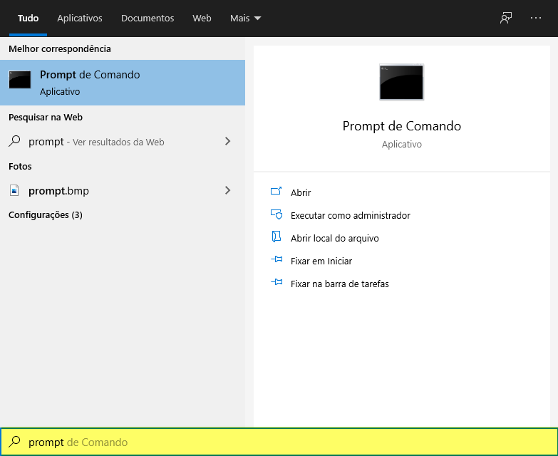
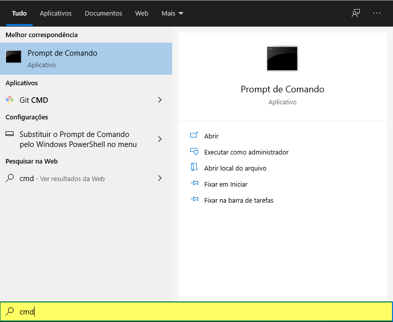
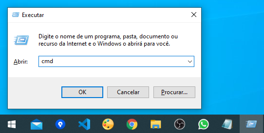
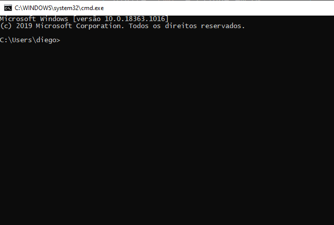
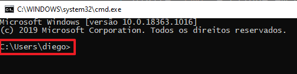

# Shell de comandos (Prompt de comandos)

O shell de comandos é um programa que reproduz uma interface de usuário baseada em texto na interface gráfica do usuário (GUI) do Windows.

Ele pode ser usado para executar comandos inseridos, básicos e avançados e realizar funções administrativas em um computador. O prompt muitas vezes é utilizado na resolução de muitos problemas de uso do Windows, sejam eles a nível de operacionalização, automação, desenvolvimento e outras características de um Técnico em Informática.

## Primeiros passos: como abrir

### Opção 01

1. Clique no botão Iniciar do Windows
1. Na caixa de pesquisa e digite uma das opções abaixo:
   * prompt
   
   * cmd
   

### Opção 02

1. Pressione a sequência de teclas   +  + R
1. Na caixa de diálogo `Executar`, digite `cmd` e clique em OK:


Todas as opções levam à janela a seguir:



## Prompt: o que é

Importante diferenciarmos o que é um prompt e o que é um shell.

Um shell é uma interface que nos possibilite a interação com o Sistema Operacional. Neste caso, estamos interagindo via interface de linha de comando.

O prompt nada mais é que a estrutura exibida inicialmente pelo shell, independente do Sistema Operacional:



Ele pode ser alterado para exibir o que você desejar, como o nome do diretório atual, data e hora do sistema. O valor padrão é o caminho do diretório atual (_path_), seguido do colchete angular ">"

### Sintaxe

```sh
prompt <opções>
```

#### Opções

<https://docs.microsoft.com/en-us/windows-server/administration/windows-commands/prompt>

#### Valor padrão

```sh
prompt
```

ou

```sh
prompt $p$g
```

ou

```sh
prompt $m$p$g
```

* $m --> nome remoto associado a pasta, no caso de ser um diretório de rede.
* $p --> caminho completo da pasta atual.
* $g --> caracter ">".

## Comandos básicos

### help

Exibe a ajuda do shell de comandos.

### tree

Exibe graficamente a estrutura de diretório do path atual ou de um especificado.

## Arquivos, diretórios e caminhos (_paths_)

Aqui são demonstrados os conceitos básicos de arquivo e diretório (pasta) no contexto de computação.

### Arquivos

Conjunto de dados que se relacionam de alguma forma, descrevendo uma ou mais informações.

Para a computação, os arquivos são formados por _bytes_, organizados seguindo algum tipo de estrutura ou formato.

Um arquivo pode representar informações das mais diversas naturezas, como um texto ou imagem, por exemplo.

Cada arquivo precisa de uma identificação. No ponto de vista do Sistema Operacional, ele possui uma identificação de endereço no disco secundário. Abordaremos detalhes quando falarmos de __Sistema de Arquivos__.

No ponto de vista do usuário, um arquivo possui um nome.

### Diretórios

É uma subdivisão lógica que indica o caminho virtual de um arquivo ou diretório no seu disco secundário, permitindo a organização e o agrupamento dos mesmos.
> Uma pasta ou diretório é um artefato virtual no sistema operacional: serve para te ajudar a organizar seus arquivos e não ocupa espaço
> Diretórios são chamados de pastas em função da analogia utilizada em sistemas Windows e que é adotada até os anos atuais.

#### Diretório raiz

É o primeiro diretório na hierarquia. Em sistemas Windows, é representado geralmente por `\` (`C:\`) e em sistemas Unix, por `/`.

### Caminhos (_Paths)

Um caminho ou _path_ é o que determina a localização única a nível de usuário de um arquivo ou diretório em uma árvore de diretórios.

Eles são utilizados em diversas situações, quando para referenciar arquivo ou diretório.

A depender do sistema operacional, podemos ter os seguintes caracteres delimitadores:

`:` - dois pontos --> utilizado para expressar uma unidade de disco em sistemas Windows.

`\`- contrabarra --> utilizado para expressar a hierarquia entre um diretório e um subdiretório ou arquivo contido, em Sistemas Windows.

`\\` - dupla contrabarra --> utilizado para expressar a hierarquia entre uma localização remota, acessível pelo computador e um subdiretório ou arquivo contido, em Sistemas Windows.

`/`- barra --> utilizado para expressar a hierarquia entre um diretório e um subdiretório ou arquivo contido, em Sistemas Unix.

Exemplos:

~~~absolutos
C:\Users\Diego
C:\Users\Diego\Desktop
\Users\Diego\Desktop
~~~

~~~relativos
..\Diego\Desktop
..\..\Users\Diego
~~~

Os caminhos podem ser classificados em caminhos absolutos ou relativos.

#### Caminho absoluto

Caminho __absoluto__ ou __completo__ determina o caminho exato de um arquivo ou diretório, independente da localização atual. 

Deve-se incluir o diretório raiz (`\`).  

#### Caminho relativo

O caminho __relativo__ é determinado a partir da localização atual

## Comandos básicos - Diretório

### dir (_directory_)

Exibe o conteúdo de um diretório. Quando não especificado um, exibe o conteúdo do diretório atual.

### cd (_change directory_)

Altera o diretório corrente. Quando não especificado um, exibe o _path_ atual.

### md ou mkdir (_make directory_)

Cria um ou mais diretórios.

### rd ou rmdir (_remove directory_)

Remove um ou mais diretórios.

TODO: listar demais comandos.

## Saída do shell

A saída do shell ou console é um evento de impressão das informações em tela.
Além da saída padrão no próprio console, é possível __redirecionar__ a saída para outros locais:

* Arquivo;
* Área de transferência.

Isto é útil quando você precisa salvar as informações de processamento do console em um arquivo a ser enviado em um relatório, por exemplo.

### Redirecionar para a área de transferência

### Redirecionar para um arquivo

#### Criando um novo (ou substituindo) um arquivo

#### Concatenando informações em um arquivo

#### Redirecionando erros