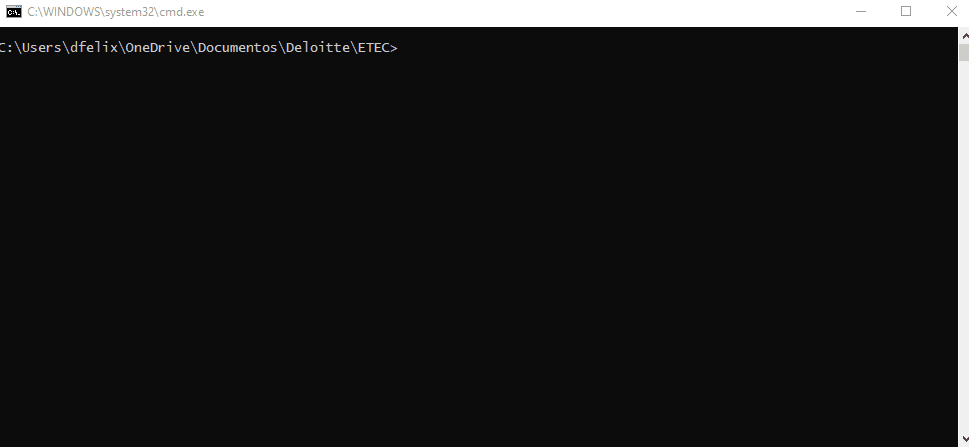

# Shell de comandos (Prompt de comandos)

O shell de comandos é um programa que reproduz uma interface de usuário baseada em texto na interface gráfica do usuário (GUI) do Windows.

Ele pode ser usado para executar comandos inseridos, básicos e avançados e realizar funções administrativas em um computador. O _shell_ muitas vezes é utilizado na resolução de muitos problemas de uso do Windows, sejam eles a nível de operacionalização, automação, desenvolvimento e outras características de um Técnico em Informática.

## Índice

* [Primeiros passos: como abrir](#primeiros-passos-como-abrir)
  * [Opção 01](#op%C3%A7%C3%A3o-01)
  * [Opção 02](#op%C3%A7%C3%A3o-02)
* [Prompt: o que é](#prompt-o-que-%C3%A9)
  * [Sintaxe](#sintaxe)
    * [Valor padrão](#valor-padr%C3%A3o)
    * [Opções - prompt](#op%C3%A7%C3%B5es---prompt)
* [Comandos básicos de ajuda](#comandos-b%C3%A1sicos-de-ajuda)
  * [help](#help)
  * [Parâmetro `? (/?)`](#par%C3%A2metro--)
* [Arquivos, diretórios e caminhos (_paths_)](#arquivos-diret%C3%B3rios-e-caminhos-paths)
  * [Arquivos](#arquivos)
  * [Diretórios](#diretórios)
    * [Diretório raiz](#diret%C3%B3rio-raiz)
  * [Caminhos (_Paths_)](#caminhos-paths)
    * [Caminho absoluto](#caminho-absoluto)
    * [Caminho relativo](#caminho-relativo)
* [Comandos básicos - Diretório](#comandos-b%C3%A1sicos---diret%C3%B3rio)
  * [dir (_directory_)](#dir-directory)
  * [cd ou chdir (_change directory_)](#cd-ou-chdir-change-directory)
  * [md ou mkdir (_make directory_)](#md-ou-mkdir-make-directory)
  * [rd ou rmdir (_remove directory_)](#rd-ou-rmdir-remove-directory)
  * [tree](#tree)
* [Comandos básicos - Arquivos](#comandos-b%C3%A1sicos---arquivos "Comandos básicos - Arquivos")
  * [copy](#copy)
  * [xcopy](#xcopy)
  * [robocopy](#robocopy)
  * [mv ou move](#mv-ou-move)
  * [ren ou rename](#ren-ou-rename)
  * [del ou delete](#del-ou-delete)
  * [attrib](#attrib)
  * [type](#type)
  * [edit](#edit)
  * [find](#find)
  * [comp](#comp)
* [Comandos básicos - sistema](#comandos-b%C3%A1sicos---sistema)
  * [cls](#cls)
  * [title](#title)
  * [date](#date)
  * [time](#time)
  * [ver](#ver)
* [Trabalhando com mais de um comando por instrução](#trabalhando-com-mais-de-um-comando-por-instru%C3%A7%C3%A3o)  
* [Saída do shell](#sa%C3%ADda-do-shell)
  * [Redirecionar para a área de transferência](#redirecionar-para-a-%C3%A1rea-de-transfer%C3%AAncia)
  * [Redirecionar para um arquivo](#redirecionar-para-um-arquivo)
    * [Criando um novo (ou substituindo) um arquivo](#criando-um-novo-ou-substituindo-um-arquivo)
    * [Concatenando informações em um arquivo](#concatenando-informa%C3%A7%C3%B5es-em-um-arquivo)
    * [Redirecionando erros](#redirecionando-erros)

## Primeiros passos: como abrir

### Opção 01

1. Clique no botão Iniciar do Windows
1. Na caixa de pesquisa e digite uma das opções abaixo:
   * prompt

   

   * cmd

   

### Opção 02

1. Pressione a sequência de teclas  + R
1. Na caixa de diálogo `Executar`, digite `cmd` e clique em OK:


Todas as opções levam à janela a seguir:


## Prompt: o que é

Importante diferenciarmos o que é um prompt e o que é um shell.

Um shell é uma interface que nos possibilite a interação com o Sistema Operacional. Neste caso, estamos interagindo via interface de linha de comando.

O prompt nada mais é que a estrutura exibida pelo shell, independente do Sistema Operacional:


Ele pode ser alterado para exibir o que você desejar, como o nome do diretório atual, data e hora do sistema. O valor padrão é o caminho do diretório atual (_path_), seguido do colchete angular ">"

### Sintaxe

```sh
prompt <opções>
```

#### Valor padrão

```sh
prompt
```

ou

```sh
prompt $p$g
```

ou

```sh
prompt $m$p$g
```

#### Opções - prompt

<https://docs.microsoft.com/en-us/windows-server/administration/windows-commands/prompt>

* `$M` --> nome remoto associado a pasta, no caso de ser um diretório de rede;
* `$P` --> caminho completo da pasta atual;
* `$G` --> caracter ">";
* `$C` --> caracter "(";
* `$F` --> caracter ")";
* `$S` --> caracter " ";
* `$_` --> retorno de carro ou quebra de linha.

Outras opções úteis:

* `%username%` --> nome do usuário logado;
* `%computername%`--> nome do computador.

## Comandos básicos de ajuda

### help

Exibe a ajuda do shell de comandos.

### Parâmetro `? (/?)`

Boa parte dos comandos aceitam o parâmetro `?` para consultar a ajuda de um determinado comando. Isto se torna muito útil quando você precisa realizar uma operação e não possui acesso a internet.

## Arquivos, diretórios e caminhos (_paths_)

Aqui são demonstrados os conceitos básicos de arquivo e diretório (pasta) no contexto de computação.

### Arquivos

Conjunto de dados que se relacionam de alguma forma, descrevendo uma ou mais informações.

Para a computação, os arquivos são formados por _bytes_, organizados seguindo algum tipo de estrutura ou formato.

Um arquivo pode representar informações das mais diversas naturezas, como um texto ou imagem, por exemplo.

Cada arquivo precisa de uma identificação. No ponto de vista do Sistema Operacional, ele possui uma identificação de endereço no disco secundário. Abordaremos detalhes quando falarmos de __Sistema de Arquivos__.

No ponto de vista do usuário, um arquivo possui um nome.

#### Arquivo morto

É um atributo de arquivo, utilizado no Windows.Ele é marcado toda vez que um arquivo é criado ou modificado e salvo. Existe desde o DOS e serve para facilitar backups.

Mostrar ou modificar esse atributo (além de "propriedades") pode ser feito com o comando "attrib" no shell de comandos. 

Esse atributo é comumente usado para fazer backups. 

Por exemplo: um programa semanalmente o backup de todos os arquivos de um computador. Após a conclusão do backup, ele remove apaga esse atributo de todos os arquivos. Nos backups seguintes, o backup só é feito dos arquivos que tenham esse atributo (ou seja, que foram modificados ou criados).

### Diretórios

É uma subdivisão lógica que indica o caminho virtual de um arquivo ou diretório no seu disco secundário, permitindo a organização e o agrupamento dos mesmos.
> Uma pasta ou diretório é um artefato virtual no sistema operacional: serve para te ajudar a organizar seus arquivos e não ocupa espaço
> Diretórios são chamados de pastas em função da analogia utilizada em sistemas Windows e que é adotada até os anos atuais.

#### Diretório raiz

É o primeiro diretório na hierarquia. Em sistemas Windows, é representado geralmente por `\` (`C:\`) e em sistemas Unix, por `/`.

### Caminhos (_Paths_)

Um caminho ou _path_ é o que determina a localização única a nível de usuário de um arquivo ou diretório em uma árvore de diretórios.

Eles são utilizados em diversas situações, quando para referenciar arquivo ou diretório.

A depender do sistema operacional, podemos ter os seguintes caracteres delimitadores:

`:` - dois pontos --> utilizado para expressar uma unidade de disco em sistemas Windows.

`\`- contrabarra --> utilizado para expressar a hierarquia entre um diretório e um subdiretório ou arquivo contido, em Sistemas Windows.

`\\` - dupla contrabarra --> utilizado para expressar a hierarquia entre uma localização remota, acessível pelo computador e um subdiretório ou arquivo contido, em Sistemas Windows.

`/`- barra --> utilizado para expressar a hierarquia entre um diretório e um subdiretório ou arquivo contido, em Sistemas Unix.

Os caminhos podem ser classificados em caminhos absolutos ou relativos.

#### Caminho absoluto

```bash
C:\Users\Diego
C:\Users\Diego\Desktop
\Users\Diego\Desktop
```

Caminho __absoluto__ ou __completo__ determina o caminho exato de um arquivo ou diretório, independente da localização atual.

Deve-se incluir o diretório raiz (`\`).  

#### Caminho relativo

O caminho __relativo__ é determinado a partir da localização atual.

Então, utiliza-se as referências para se determinar caminhos relativos:

* **acima** da localização atual. Quanto mais acima, mais distante da raiz.

```bash
C:\Users\Diego>cd Pictures\Screenshots

#É uma referência relativa para o diretório C:\Users\Diego\Pictures\Screenshots
```

* **abaixo** da localização atual. Quanto mais abaixo, mais próximo da raiz. Cada nível é determinado por `..`:

```bash
C:\Users\Diego\Pictures\Screenshots>cd ..\..

#É uma referência relativa para o diretório C:\Users\Diego.
```

Para `C:\Users\Diego\Pictures\Screenshots`:

* `..` --> C:\Users\Diego\Pictures
* `..\..` --> C:\Users\Diego
* `..\..\..` --> C:\Users
* `..\..\..\..` --> C:\

**Obs: Não há anterior para a raiz.**

Ainda há a referência `.`, que indica a localização atual.

## Comandos básicos - Diretório

### dir (_directory_)

Exibe o conteúdo de um diretório. Quando não especificado um, exibe o conteúdo do diretório atual.

Parâmetros:

* `/A` - Exibe conteúdo com atributos especificados

   | Atributo  | Descrição                    |
   |-----------|------------------------------|
   | D         | Diretórios                   |
   | R         | Arquivos somente leitura     |
   | H         | Arquivos ocultos             |
   | S         | Arquivos de sistema          |
   | -         | Prefixo significando negação |

* `/B` - Usa formatação básica (sem informações de cabeçalho ou resumo).
* `/W` - Exibe os resultados em coluna, classificados por linha.
* `/D` - Exibe os resultados em coluna, classificados por coluna.
* `/O` - Determina uma ordenação, a partir de uma classificação

   | Ordenação  | Classificação                |
   |------------|------------------------------|
   | N          | Alfabética por nome          |
   | E          | Alfabética por extensão      |
   | G          | Diretórios primeiro          |
   | S          | Tamanho                      |
   | D          | Data e hora                  |
   | -          | Prefixo significando negação |

* `/X` - Exibe um formato curto de arquivo, muito utilizado em sistemas Windows até o 98 SE.

### cd ou chdir (_change directory_)

Altera o diretório corrente. Quando não especificado um, exibe o _path_ atual.

#### Sintaxe - cd

```bash
CD [caminho relativo]
```

```bash
CD [caminho absoluto]
```

### md ou mkdir (_make directory_)

Cria um ou mais diretórios.

#### Sintaxe - md

```bash
MD [<novoDir1 novoDir2 ...>]
```

### rd ou rmdir (_remove directory_)

Remove um ou mais diretórios.

```bash
RD [dir1 <dir2 ...>]
```

### tree

Exibe graficamente a estrutura de diretório do path atual ou de um especificado.

#### Sintaxe - tree

```bash
TREE [unidade:][caminho] [/F] [/A]
```

#### Opções - tree

* `/F` --> Exibir também o nome dos arquivos;
* `/A` --> Usa os caracteres da Tabela ASCII ao invés de caracteres estendidos (recomendado);

## Comandos básicos - Arquivos

### copy
Copia um arquivo ou grupo deles de uma origem para um destino. 

Para isso, o usuário deve digitar o comando copy mais sua localização atual e, em seguida, seu caminho de destino. 

#### Copiando um arquivo na mesma pasta

```bash
C:\Users\dfelix\aulaGSO1> copy exemplo01.txt exemplo04.txt 
```


#### Copiando um arquivo em outra pasta

```bash
C:\Users\dfelix\aulaGSO1> copy exemplo01.txt pasta1
```


**Obs: o caminho de pasta01 pode ser relativo ou absoluto!**

O comando aceita o uso de asterisco (*), para substituir caracteres. Por exemplo:

```bash
C:\Users\dfelix\aulaGSO1> copy *txt pasta2
```


### copy con

Cria um novo arquivo a partir do shell.

Sintaxe

```bash
copy con [<Drive>:][<Path>]<FileName> [ENTER]

#Digitar conteúdo de arquivo (múltiplas linhas)

[Ctrl+Z]
```

Exemplo


### xcopy

Copia arquivos e diretórios de uma origem para um destino. 

#### Parâmetros - xcopy

* `/P` - solicita confirmação ao usuário antes de copiar cada arquivo;
* `/S` - copia diretórios, desde que não estejam vazios. Para diretórios nesta última condição, basta informar /E /S;
* `/U` - copia apenas arquivos que já existem no diretório de destino.

Exemplo: 

```bash
C:\Users\dfelix\aulaGSO1> xcopy /e /s C:\Users\dfelix\aulaGSO1\pasta2 pasta3
```


### robocopy
(_EM BREVE_)

### mv ou move
Comando que assume duas funções: renomear diretórios ou arquivos ou mover arquivos.

Renomeando pastas:

```bash
C:\Users\dfelix\aulaGSO1> move pasta2 pasta02
```


Renomeando arquivos:

```bash
C:\Users\dfelix\aulaGSO1> move exemplo01.txt exemplo22.txt
```

Movendo arquivos:

```bash
C:\Users\dfelix\aulaGSO1> move exemplo02.txt pasta2
```


### ren ou rename

Comando que permite renomear arquivos ou pastas. Possui sintaxe idêntica ao mv ou move.

### del ou delete

Comando que permite excluir arquivos, baseados no critério estabelecido.

```bash
C:\Users\dfelix\aulaGSO1> del exemplo*txt
```


### attrib

Exibe, define ou remove atributos atribuídos a arquivos ou diretórios. Se usado sem parâmetros, attrib exibe atributos de todos os arquivos no diretório atual.

Parâmetros 

   | Parâmetro |	Descrição                     |
   |-----------|--------------------------------|
   | {+\|-}r   | Define ( + ) ou limpa ( - ) o atributo de arquivo somente leitura. |
   | {+\|-}a   | Define ( + ) ou limpa ( - ) o atributo de [arquivo morto*](#arquivo-morto). |
   | {+\|-}s   |	Define ( + ) ou limpa ( - ) o atributo de arquivo do sistema. |
   | {+\|-}h   | Define ( + ) ou limpa ( - ) o atributo de arquivo oculto. |
   | {+\|-}i   | Define ( + ) ou limpa ( - ) o atributo de arquivo sem conteúdo indexado. |
   | \[\<drive\>\:]<br>\[\<path\>\]<br>\[\<filename\>\] |	Especifica o local e o nome do diretório, arquivo ou grupo de arquivos para os quais você deseja exibir ou alterar atributos. <br><br> Você pode usar o ? e * caracteres curinga no parâmetro filename para exibir ou alterar os atributos de um grupo de arquivos.
   | /s	| Aplica atributos a arquivos correspondentes no diretório atual e em todos os seus subdiretórios. |
   | /d |	Aplica atributos a diretórios.|

Exemplo:


```bash
#Exibe os atributos de estruturaGSO1.txt
attrib estruturaGSO1.txt

#Adiciona o atributo "indexado" a estruturaGSO1.txt
attrib +i estruturaGSO1.txt

#Exibe os atributos de estruturaGSO1.txt
attrib estruturaGSO1.txt

#Adiciona o atributo "somente leitura" a estruturaGSO1.txt
attrib +r estruturaGSO1.txt

#Exibe os atributos de estruturaGSO1.txt
attrib estruturaGSO1.txt

#Remove os atributos "somente leitura e indexado" a estruturaGSO1.txt
attrib -i -r estruturaGSO1.txt

#Exibe os atributos de estruturaGSO1.txt
attrib estruturaGSO1.txt
```

### type

Comando que exibe o conteúdo de um arquivo texto.

Sintaxe:

```bash
type [<Drive>:][<Path>]<FileName>
```

Exemplo:


### edit

É utilizado para abrir o editor de texto no shell de comandos.

Nele, podemos salvar arquivos em várias extensões. Equivale ao `vi` do Linux.

OBS.: Este comando foi removido do Windows 10.


Dica: utilize diretamente o `notepad` ou outro editor de preferência.

### find
(_EM BREVE_)

### comp
(_EM BREVE_)

## Comandos básicos - sistema

### cls

Limpa a tela.

Exemplo:
```bash
C:\Users\Diego> cls
```


### title

Altera o título da janela do shell.

Exemplo:
```bash
C:\Users\Diego> title Aula GSO I
```


### date

Exibe e/ou altera a data do sistema.

Exemplo:
```bash
C:\Users\Diego> date
```


### time

Exibe e/ou altera a hora do sistema.

Exemplo:
```bash
C:\Users\Diego> time
```


### ver

Exibe a versão do sistema.

Exemplo:
```bash
C:\Users\Diego> ver
```


## Comandos avançados - sistema
(_EM BREVE_)

### tasklist e taskkill
(_EM BREVE_)

### path
(_EM BREVE_)

### label
(_EM BREVE_)

### chkdsk
(_EM BREVE_)

## Trabalhando com mais de um comando por instrução

Em algumas situações, você precisará executar diversos comandos em uma mesma instrução, para que os mesmos façam sentido. Os operadores abaixo fazem este papel:

* `|` (_pipe_) --> utiliza a saída do primeiro comando (à esquerda do pipe). Veja exemplo em [Sintaxe - clip](#sintaxe---clip) 

* `&` ("e" comercial) --> Caso o comando à esquerda seja inválido, o próximo (à direita) executará. 

Exemplo:

```bash
C:\Users\Diego> teste & dir
```


* `&&` (duplo "e" comercial) --> Caso o comando à esquerda seja inválido, o próximo (à direita) **não** executará.

```bash
C:\Users\Diego> teste && dir
```


Ambos `&` e `&&` aceitam continuidade, ou seja:

```bash
C:\Users\Diego> cd Desktop && dir && cd .. && dir /ad
```


## Saída do shell

A saída do shell ou console é um evento de impressão das informações em tela.
Além da saída padrão no próprio console, é possível __redirecionar__ a saída para outros locais:

* Arquivo;
* Área de transferência.

Isto é útil quando você precisa salvar as informações de processamento do console em um arquivo a ser enviado em um relatório, por exemplo.

### Redirecionar para a área de transferência

#### Sintaxe - clip

```bash
[COMANDO] | clip
```

Exemplo

```bash
C:\Users\Diego> tree /A | clip
```

### Redirecionar para um arquivo

#### Criando um novo (ou substituindo) um arquivo

```bash
[COMANDO] > meuArquivo.txt
```

Exemplo

```bash
C:\Users\Diego> tree Desktop /A > arquivosAreaTrabalho.txt
```

Obs: se o arquivo existir, ele será substituído.

#### Concatenando informações em um arquivo

```bash
[COMANDO] >> meuArquivo.txt
```

Exemplo

```bash
C:\Users\Diego> dir /w Documents >> C:\Users\Diego\Desktop\listaMeusArquivos.txt
C:\Users\Diego> dir /w Desktop >> C:\Users\Diego\Desktop\listaMeusArquivos.txt
```

#### Redirecionando erros

```bash
[COMANDO] 1> meuArquivo.txt 2> erros.txt
```

##### Exemplo - saída de erro para arquivo diferente

```bash
C:\Users\Diego> dir programa.exe 1> relatorio.txt 2> erros.txt
```

##### Exemplo - saída de erro para o mesmo arquivo

```bash
C:\Users\Diego> dir programa.exe 1> relatorio.txt 2>&1
```

Obs: da mesma forma, pode-se usar o operador `>>` caso queira que a saída do comando seja concatenada em arquivo existente.

##### Concatenando saída e erro:

```bash
C:\Users\Diego> dir programa.exe 1>> relatorio.txt 2>>&1
```

ou

```bash
C:\Users\Diego> dir programa.exe 1>> relatorio.txt 2>> erros.txt
```

##### Concatenando __somente__ saída:

```bash
C:\Users\Diego> dir programa.exe 1>> relatorio.txt 2> erros.txt
```

##### Concatenando __somente__ erro:

```bash
C:\Users\Diego> dir programa.exe 1> relatorio.txt 2>> erros.txt
```